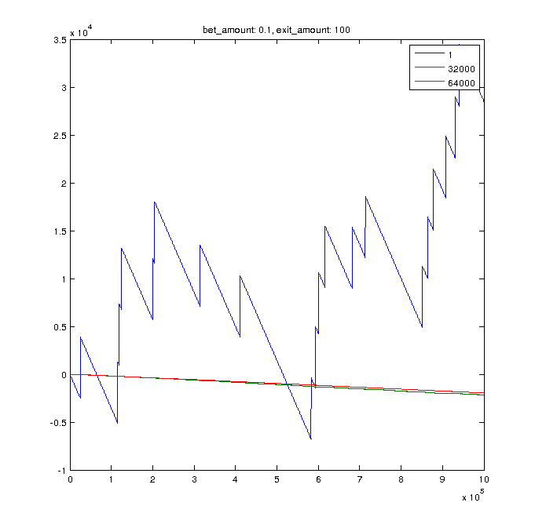
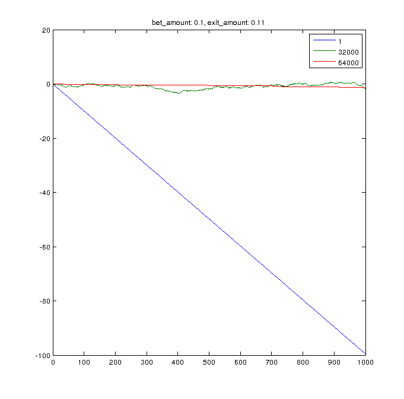
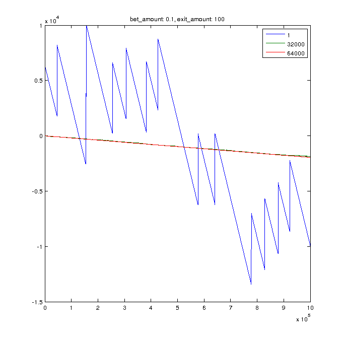

SatoshiDice Experiments
======

A simulator for experimenting with new ideas for playing SatoshiDice.

How does it work?
----

In each run, the strategy is to play a small amount on a specific bet (`bet_amount`) until the profit reaches a certain amount (`exit_amount`) or a maximum number of bets placed (`N`).

At the end of each run, player's profit and the number of bets placed to that point is saved and this process is repeated until we simulate for `T` times.

The default values for this parameters are:

- `T: 10`
- `N: 1000000`
- `bet_amount: 0.01`
- `exit_amount: 100`

Also, to lower the complexity of the results I chose only three kinds of bets from SatoshiDice, `lessthan 1`, `lessthan 32000` and `lessthan 64000`.

<pre>

bets = [1 32000 64000];
multipliers = [64000.000 2.004 1.004];

</pre>

You can modify these variables in `config.m` according to your own strategy.

At the end of the whole simulation, the program outputs a number of statistics. For example,

<pre>

how_many_successful_exits =

     9
     0
     0

avg_exit_positions =

   1.0e+05 *

    1.1718
         0
         0

avg_required_pocket_depth =

   1.0e+03 *

   -1.1299
   -0.1789
   -0.1839

</pre>

What's it good for?
----

Clearly, SatoshiDice will make you lose in long term. But using this
tool, you can "choose" your own settings of the game and play
accordingly.

For example, we see that 9 out of 10 experiments we achieved our
objective of reaching a 100 BTC profit, starting with nothing. That
might seem great, but not so much. Because, you have to play the game
for about 100000 times on average. And even worse, you must already
have about 1-2 thousand BTC's to spend when the profit is below
zero. Maybe a lot worse is that you might lose money on several
thousands scale while winning only 9 times 100 BTC's.

Usage
----

If you have Matlab or Octave, change to the project directory and run

> clear all; config; satoshi_experiments

in console.

It will run a series of simulations with parameters set in `config.m`.

The script will plot the profit of the run.

Donation
----

If you think it helped you in any way, please donate to this Bitcoin address:

1Bz7ievtpw76EEU6tyN74owPgAnCxViL4s

